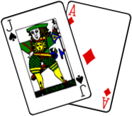

# BlackJack




BlackJack is a small graphical tool that I built to help me improve at counting cards.

It is essentially a GUI BlackJack game with a window that prints out probabilities,
statistics, and combinatorial information about the active game. Features include
specifying the number of players, and number of decks the dealer will use.

## Requires

Before you begin:

* Install Python >= 3.6
* Windows OS (Might work on others but I have not tested it.)
* Install PyQt6 through pip
* Install Pytests for testing
* Reviewed the Licesnse and Documentation for whatever reason.

### Installing BlackJack

To install, follow these steps:

1. Ensure Git is installed and working
2. Open terminal and run ...

```Windows:
pip install PyQt6

git clone https://github.com/alexpdev/blackjack.git blackJack
```

### Usage

```Windows
python path\to\project\main.py
```

### License

BlackJack uses the following license: GNU LGPL v3.0

### Other

* Requires PyQt6, Python3, [pytest]
* entry point for execution is main.py
* card images are stored in img folder
